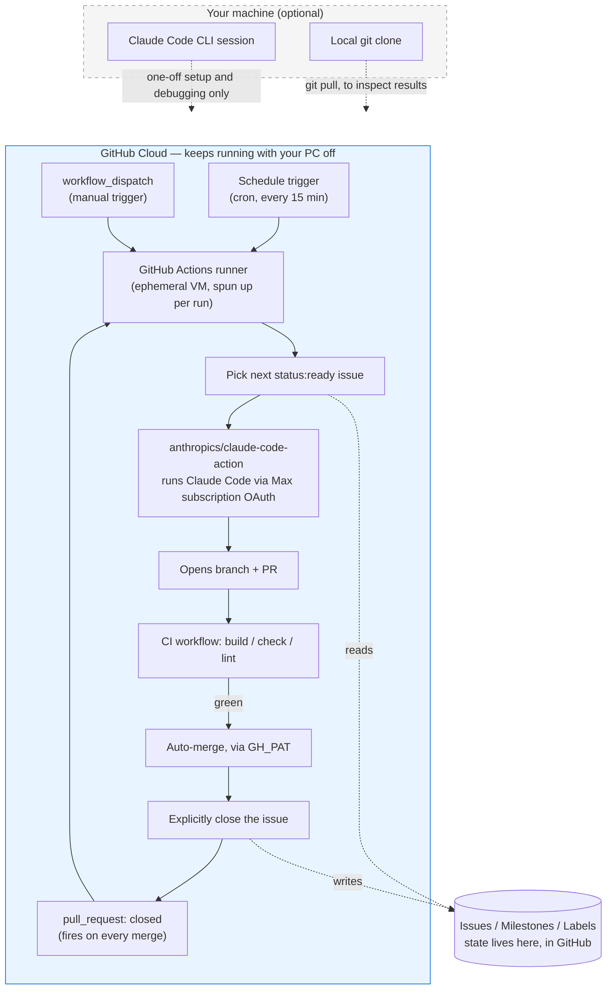

# GitHub Setup — Lessons Learned

Notes from building the autonomous `claude-build.yml` pipeline for this repo. Kept as a reference for future GitHub Actions / Claude Code automation work, not just this project.

---

## Where does this actually run?

The whole loop — schedule trigger, issue picking, Claude Code, PR, CI, auto-merge, chaining to the next issue — runs on GitHub's own infrastructure. A local machine is only ever used to set the pipeline up or inspect its results; it is never in the runtime loop, so it can be powered off at any time without affecting the pipeline.



Everything the pipeline needs to remember between runs — which issue is next, what's in progress, what's merged — is stored as GitHub issue/label state, not local state. That's what makes it safe to walk away from.

---

## Multi-account access (mmorrow2012 vs mmorrow24work)

**`gh` CLI auth is independent of your browser login.** Being logged into github.com in a browser as one account has no effect on which account `gh` (and any script using it) authenticates as — that's controlled entirely by `gh auth status` / the stored token in `~/.config/gh/hosts.yml`. Mixing the two up cost real time here: a `PUT .../collaborators/...` call meant to be run as the repo owner kept 404ing because it was actually running as the collaborator account trying to grant itself admin — which GitHub silently refuses (a collaborator cannot elevate their own permission via the API, and a 404 rather than 403 is the error you get).

**Collaborator permission levels that matter:**
| Level | Unlocks |
|---|---|
| `pull` | Read only — can't create labels, milestones, push, or set secrets |
| `push` | Write — labels, milestones, issues, pushing branches, opening PRs |
| `admin` | Required for branch protection rules and repo secrets (Actions secrets specifically need admin in the classic permission model) |

Bumping an existing collaborator's role from Write to Admin has to be done by an account that is already Admin/Owner — via the web UI (`Settings → Collaborators and teams → Manage access`, a small role control on that person's row — on some GitHub UI revisions it's a "..." kebab menu rather than an obvious dropdown) or via API using **that owner's own token**:
```sh
GH_TOKEN=<owner's PAT, used inline for one command only> gh api -X PUT repos/<owner>/<repo>/collaborators/<user> -f permission=admin
```
Prefixing `GH_TOKEN=` on a single command overrides the stored `gh` auth for just that invocation without touching your normal session.

**If a classic PAT still 404s on that call**, check it was generated as a full classic token (the top-level `repo` scope checkbox) and not a fine-grained token scoped to specific permissions that happens to omit repository administration.

**Forking solves this cleanly.** If getting admin on someone else's repo turns into a saga, forking it gives the forking account full owner/admin rights automatically, with zero permission negotiation. That's what this repo ended up doing — `origin` points at the fork, `upstream` points at the original.

**Security: never paste a real token into chat/a shared terminal log.** Treat it as compromised the moment it's displayed, even if the command using it fails — revoke and regenerate rather than reusing it "just this once more."

---

## Forks have different defaults than the parent repo

- **Issues are disabled by default on a fork.** `gh issue create` fails with `the '<repo>' repository has disabled issues` until you run `gh repo edit <repo> --enable-issues`.
- **Auto-merge is not enabled by default.** `gh repo edit <repo> --enable-auto-merge` (plus optionally `--enable-squash-merge --delete-branch-on-merge`) before `gh pr merge --auto` will work.

---

## Branch protection for a required CI gate

```sh
gh api -X PUT repos/<owner>/<repo>/branches/main/protection --input protection.json
```
with a body like:
```json
{
  "required_status_checks": { "strict": false, "contexts": ["build"] },
  "enforce_admins": false,
  "required_pull_request_reviews": null,
  "restrictions": null,
  "allow_force_pushes": false,
  "allow_deletions": false
}
```
- `contexts` must match the **actual CI job name** (the `jobs.<id>` key, or its `name:` if set), not the workflow file name.
- `enforce_admins: false` lets an admin bypass the check for a deliberate one-off direct push (GitHub logs this as "Bypassed rule violations" — a useful signal that it happened intentionally). Non-admin actors — including a workflow's `github-actions[bot]` identity via the default `GITHUB_TOKEN` — do **not** get this bypass, which is exactly what you want for an automated merge gate to mean anything.

---

## `anthropics/claude-code-action@v1` specifics

**Auth input name:** `claude_code_oauth_token`, not `anthropic_oauth_token`. Generate the token with `claude setup-token` (opens a browser OAuth flow tied to a Pro/Max/Team/Enterprise subscription; consumes session budget rather than pay-per-token API billing). Token is valid **one year**; re-run the command to mint a new one after expiry. Store it as a repo secret and never in chat/logs.

**`id-token: write` is required even when *not* using Workload Identity Federation.** The action exchanges a GitHub Actions OIDC token for its own scoped GitHub App installation token internally, regardless of which Anthropic auth method you're using. Omitting this permission fails with `Could not fetch an OIDC token... Did you remember to add id-token: write`.

**Default tool permissions for non-comment-triggered runs are read-only.** The action auto-detects "agent mode" for `schedule` / `workflow_dispatch` (vs. "tag mode" for `@claude` comment triggers), and agent mode's default `--allowedTools` is just `Glob, Grep, LS, Read` (confirmed against the action's own source, `buildAllowedToolsString()`). Any real work — writing files, running `npm`/`git` — needs those tools granted explicitly:
```yaml
claude_args: "--allowedTools Bash,Write,Edit,Read,Glob,Grep,LS"
```
Symptom without this: the run reports success (`is_error: false`) in well under a minute, with a nonzero `permission_denials_count` in the result JSON and no branch/PR ever created. It looks like nothing happened because, functionally, almost nothing was allowed to happen.

Do **not** trust a plausible-sounding `--permission-mode auto` (or similar) flag suggested by search/research without checking it against the action's actual `examples/` and source — one research pass surfaced exactly this, flagged by the harness as containing instruction-shaped content, and it does not exist anywhere in Anthropic's real docs or source. `--allowedTools` (with `--allowed-tools` as an alias) is the real, documented mechanism.

**`branch_name` / `session_id` action outputs are only populated in tag mode.** In agent mode, Claude creates its own branch via `Bash`/`git` as instructed in the prompt — the action has no built-in visibility into that, so `steps.claude.outputs.branch_name` stays empty even on a fully successful run that opened a real PR. Detect the PR yourself instead, e.g. by searching open PR bodies for the "Closes #N" text you told Claude to include:
```sh
gh pr list --state open --json number,headRefName,body \
  | jq -c --arg n "$ISSUE_NUMBER" '[.[] | select(.body | test("[Cc]loses #" + $n + "(\\D|$)"))] | .[0] // empty'
```

**`show_full_output: true` is a debugging aid, not a production setting.** Default output hides the per-turn transcript ("full output hidden for security"), showing only the final result JSON (`num_turns`, `total_cost_usd`, `permission_denials_count`, `subtype`). That's normally enough to diagnose failures; reach for `show_full_output` only when the result JSON alone doesn't explain what happened, and turn it back off afterward.

**`--max-turns` needs real headroom, not a tight guess.** A task that's genuinely well-scoped (e.g. "add nav shell + routing") can still legitimately need 50–60+ turns once you count reading context docs, writing several files, running build/check/lint, fixing what those catch, and doing the git/PR operations. Cutting the limit close to what you *think* is needed produces `error_max_turns` failures right at the boundary that look like a stuck/oversized task but are actually just normal work with no margin. Before concluding a task is oversized and needs splitting, run once with a materially higher cap (and `show_full_output: true` if still unsure) to see whether it was genuinely too large or just under-budgeted.

**If a single issue is genuinely oversized** even with a generous turn budget (confirmed via a `show_full_output` run showing real, non-looping progress that still won't fit), split it into smaller issues rather than keep raising the cap indefinitely. Watch out for issue-number-based ordering when you do this — new issues get the next sequential numbers and will sort after everything already created; if a "pick the next issue" script sorts by raw issue number, split-off issues can silently jump to the back of the whole queue instead of running where they're needed. Sorting by `(milestone number, issue number)` fixes this without needing to manually pause/reorder existing issues.

---

## Instant chaining vs. `GITHUB_TOKEN`'s anti-recursion protection

**A PR merged using a workflow's default `GITHUB_TOKEN` does not trigger other workflow runs.** This is deliberate on GitHub's part, to prevent infinite automation loops. It was confirmed directly here: a PR merged manually by a human (using their own `gh` auth) correctly fired the next `pull_request: closed`-triggered run; the very next PR, auto-merged by the pipeline itself using the job's default `GITHUB_TOKEN`, did not — the pipeline silently fell back to waiting for the next cron tick instead of chaining immediately.

**Fix: use a real account's PAT for the merge (and generally for the job's `gh` calls), not the default token.**
```yaml
env:
  GH_TOKEN: ${{ secrets.GH_PAT }}   # not secrets.GITHUB_TOKEN
```
A fine-grained PAT scoped to just the one repo, with Contents/Issues/Pull requests set to read+write, is enough. Merges performed under a PAT are attributed to the real account (confirmed via `gh pr view <n> --json mergedBy`) and behave like a normal human merge for the purpose of triggering downstream workflows.

**Concurrency control makes multiple trigger sources safe to combine.** Running both a `schedule` cron (as a backstop/catch-up) and a `pull_request: closed` trigger (for instant chaining) on the same workflow means both can fire close together. A `concurrency` block prevents them from racing each other:
```yaml
concurrency:
  group: claude-build
  cancel-in-progress: false
```
`cancel-in-progress: false` means a second trigger queues behind whichever run is already in progress rather than being cancelled or running in parallel — confirmed working when a schedule-triggered run and a merge-triggered run landed within seconds of each other and queued correctly instead of clobbering one another.

---

## "Closes #N" doesn't always auto-close the issue

Even when GitHub correctly recognizes the link (visible via `gh pr view <n> --json closingIssuesReferences`), the linked issue can fail to actually close automatically on merge. Observed **repeatedly** on this fork (not a one-off): two separate merges, each with a correctly parsed `closingIssuesReferences` entry, left the referenced issue open. Root cause unconfirmed (possibly fork-specific), but reliable enough to design around rather than debug further: have the pipeline explicitly close the issue itself on merge instead of depending on GitHub's automatic behavior —
```sh
issue_number=$(echo "$PR_BODY" | grep -ioP '[Cc]loses #\K\d+' | head -1)
gh issue close "$issue_number" --reason completed
```
gated on the workflow's `pull_request` trigger with `github.event.pull_request.merged == true`.
